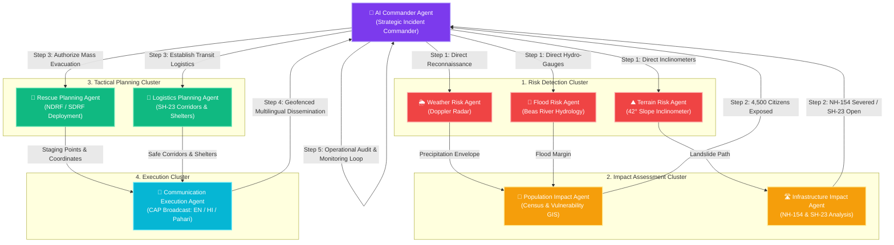

# 🚨 ASCENDANT AGENTS
### Autonomous Multi-Agent Crisis Response & Disaster Management System
**Team VORTEX** • *Disaster Response AI Architecture*

---

[](https://www.python.org/)
[](https://fastapi.tiangolo.com/)
[](https://developer.mozilla.org/en-US/docs/Web/API/WebSockets_API)
[](https://docs.pydantic.dev/)
[](https://leafletjs.com/)
[]()
[](LICENSE)

---

## 📌 Executive Summary

**ASCENDANT AGENTS** is an autonomous multi-agent disaster intelligence and tactical response system engineered to solve catastrophic multi-hazard emergencies in complex terrains. 

During extreme environmental crises—such as sudden cloudbursts, severe flash flooding, and mountain landslides—human command centers often suffer from severe cognitive overload, fragmented communication channels, and delayed operational execution. 

ASCENDANT AGENTS deploys a synchronized swarm of **9 specialized AI agents** operating over a shared state machine to:
1. **Ingest and analyze multi-modal telemetry** (Doppler weather radar, borehole inclinometers, river hydrometric sensors).
2. **Quantify population and critical infrastructure risk** through cadastral GIS overlays.
3. **Formulate high-precision tactical action plans** (SAR unit deployment, evacuation bus corridors, and emergency shelter provisioning).
4. **Disseminate real-time Common Alerting Protocol (CAP) broadcasts** with 100% localized dialect penetration (English, Hindi, and Mandyali Pahari).
5. **Autonomously replan in real time** when dynamic citizen SOS distress calls are intercepted.

---

## 🏔️ The Mandi Valley Scenario

The operational prototype is calibrated for the high-altitude, landslide-prone region of **Mandi, Himachal Pradesh, India** (`31.7087° N, 76.9320° E`):

```
                        [ CLOUDBURST: 145 mm/hr ]
                                   │
                                   ▼
                   ┌───────────────────────────────┐
                   │  42° Mountain Slope (Bhiuli)  │
                   │  Soil Saturation: 94.5%       │
                   │  Shear Displacement: 41mm/hr  │
                   └───────────────┬───────────────┘
                                   │
                    [ CATASTROPHIC LANDSLIDE ]
                                   │
         ┌─────────────────────────┴─────────────────────────┐
         ▼                                                   ▼
 ┌───────────────────────────────┐           ┌───────────────────────────────┐
 │   NH-154 Severed at KM 12.4   │           │   Beas River Surging +1.2m    │
 │   18,500 m³ boulder blockage  │           │   Above Critical Danger Mark  │
 └───────────────┬───────────────┘           └───────────────┬───────────────┘
                 │                                           │
                 └─────────────────────┬─────────────────────┘
                                       ▼
                       ┌───────────────────────────────┐
                       │  4,500 Citizens in Danger     │
                       │  Bhiuli • Victoria • Pandoh   │
                       └───────────────────────────────┘
```

- **Extreme Weather**: Doppler Radar RR-02 records `145.0 mm/hr` torrential precipitation (extreme cloudburst threshold).
- **Severe Geotechnical Risk**: 42° slope inclinometer SI-09 registers shear failure ($FoS = 0.65 < 1.0$) with 18,500 $\text{m}^3$ debris flow.
- **Hydrological Surcharge**: Beas River hydro-gauge RG-04 rises to `4.20 m` ($+1.2\text{m}$ above critical danger level) from Pandoh discharge.
- **Infrastructure Crisis**: National Highway 154 (Chandigarh–Manali route) blocked at KM 12.4, trapping 4,500 civilians across 3 sectors.
- **Autonomous Solution**: The system rapidly discovers, tests, and opens the **SH-23 High Ridge Bypass via Kataula**, coordinating 30 HRTC evacuation buses, NDRF/SDRF tactical teams, and tri-lingual emergency alerts.

---

## 🧠 Multi-Agent Swarm Architecture

The core architecture is organized into **4 specialized agent clusters** governed by the **AI Commander**:



### Agent Roles & Responsibilities

| Agent | Category | Role & Core Functionality |
| :--- | :--- | :--- |
| **👑 AI Commander** | `Orchestrator` | Synthesizes multi-agent intelligence, resolves operational tradeoffs, issues binding emergency directives, and handles dynamic citizen SOS escalations. |
| **🌦️ Weather Risk Agent** | `Risk Detection` | Ingests Doppler precipitation data (`145 mm/hr`), assesses convective storm cell velocity, and triggers cloudburst envelope alerts. |
| **⛰️ Terrain Risk Agent** | `Risk Detection` | Ingests borehole inclinometer SI-09 & DEM models, calculates Mohr-Coulomb shear strain and Factor of Safety ($FoS = 0.65$), predicting debris flow. |
| **🌊 Flood Risk Agent** | `Risk Detection` | Evaluates Beas River RG-04 hydrographs and Pandoh Dam discharge (84,000 cusecs), warning of a $+1.2\text{m}$ river surcharge. |
| **👥 Population Impact Agent** | `Impact Assessment` | Intersects hazard polygons with municipal ward census data; isolates 4,500 exposed individuals, highlighting 380 elderly and 45 mobility-impaired persons. |
| **🛣️ Infrastructure Impact Agent** | `Impact Assessment` | Assesses road/bridge integrity; identifies the 18,500 $\text{m}^3$ blockage on NH-154 and validates the **SH-23 High Ridge Bypass** as a viable alternative. |
| **🚁 Rescue Planning Agent** | `Tactical Planning` | Dispatches **NDRF 14th Bn Bravo** (Zodiac boats for floodplain) and **SDRF HP Mountain Squad Alpha** (high-angle rope rescue for slopes); places IAF Mi-17 choppers on standby. |
| **🚌 Logistics Planning Agent** | `Tactical Planning` | Seals NH-154, establishes SH-23 evacuation green corridor, mobilizes 30 HRTC buses, and activates Vallabh College (Cap: 3000) & Ridge (Cap: 2000) shelters. |
| **📢 Communication Agent** | `Execution` | Dispatches geofenced Common Alerting Protocol (CAP) SMS & triggers outdoor sirens in **English, Hindi (हिन्दी), and Mandyali Pahari (मंडयाली)**. |

---

## ✨ Key Features & Capabilities

### 1. 🛰️ Live GIS Tactical Situation Map (Leaflet.js)
- **Interactive Multi-layer GIS Visualization**: Displays severe landslide hazard zones (red), flood inundation zones (amber), safe refuge shelters (green), blocked highway segments, and open evacuation routes.
- **Dynamic Entities**: Displays real-time location pins for sensor nodes (radar, inclinometers, river gauges), tactical responder units (NDRF, SDRF), and active citizen SOS distress beacons.

### 2. ⚡ Autonomous & Step-by-Step Execution Modes
- **Full Autonomous Chain**: Trigger the entire 6-phase response lifecycle end-to-end with one click.
- **Interactive Step-by-Step Mode**: Step through individual agent executions (Assessment $\rightarrow$ Risk $\rightarrow$ Impact $\rightarrow$ Planning $\rightarrow$ Communication $\rightarrow$ Audit), ideal for live presentations and pitch demonstrations.

### 3. 🧠 Transparent Chain-of-Thought (CoT) Reasoning Logs
- Live interactive scratchpad displaying each agent's internal thought process, reasoning steps, confidence score, raw prompt preview, and structured JSON output.

### 4. 🌐 Multilingual Common Alerting Protocol (CAP) with TTS
- Generates synchronized emergency broadcast alerts in three languages:
  - **English**: Institutional and interstate traveler alerts.
  - **Hindi (हिन्दी)**: Regional administrative broadcast.
  - **Mandyali Pahari (मंडयाली)**: Dialect-specific warnings tailored for local mountain communities.
- **Text-to-Speech (TTS)**: Built-in voice playback using the Web Speech API with audio alarm effects.

### 5. 🆘 Dynamic Citizen SOS Injection & Real-Time Tactical Rerouting
- Interactive SOS distress modal allowing the simulation of real-time citizen distress beacons.
- **Autonomous Rerouting**: The AI Commander intercepts incoming coordinates, generates an immediate extraction directive, reassigns the closest SDRF unit, and broadcasts updates live via WebSockets.

### 6. 🔄 Dual WebSocket & REST API Architecture
- Full bidirectional WebSocket stream (`/ws/stream`) for real-time frontend state synchronization and low-latency command updates.

---

## 🛠️ Technology Stack

| Layer | Technology | Description |
| :--- | :--- | :--- |
| **Backend Core** | **Python 3.10+** | High-performance asynchronous backend runtime |
| **Web Framework** | **FastAPI** | Modern, fast ASGI web framework with automatic OpenAPI documentation |
| **Data Validation** | **Pydantic v2** | Strict schema validation, state models, and serialization |
| **Streaming** | **WebSockets / asyncio** | Full-duplex real-time state synchronization |
| **Server** | **Uvicorn** | Lightning-fast ASGI server implementation |
| **Frontend Core** | **HTML5 / CSS3 / Vanilla JS** | Pure zero-dependency client with modern ES6+ modular architecture |
| **Mapping Engine** | **Leaflet.js v1.9** | Lightweight interactive mapping engine with vector polygons and custom markers |
| **UI Design System** | **Glassmorphism & CSS Grid** | Dark theme, neon accents, micro-animations, and responsive layout |
| **Icons & Media** | **Lucide Icons & Canvas Confetti**| Modern vector iconography and interactive celebration effects |

---

## 📁 Repository Structure

```text
newprojkt/
├── backend/
│   ├── agents/
│   │   ├── __init__.py               # Agent package initialization
│   │   ├── commander_agent.py        # Master AI Commander logic & SOS escalation
│   │   ├── risk_agents.py            # Weather, Terrain, and Flood Risk agents
│   │   ├── impact_agents.py          # Population and Infrastructure impact agents
│   │   ├── planning_agents.py        # Search & Rescue and Logistics planning agents
│   │   ├── execution_agents.py       # Multilingual CAP communication agent
│   │   ├── orchestrator.py           # MultiAgentOrchestrator state machine
│   │   ├── state.py                  # MultiAgentWorkflowState definition
│   │   └── test_e2e.py               # Comprehensive REST & WebSocket test suite
│   ├── data/
│   │   ├── __init__.py
│   │   └── mandi_gis.py              # Geospatial coordinates, telemetry & hazard layers
│   ├── models/
│   │   ├── __init__.py
│   │   └── schemas.py                # Pydantic models (Telemetries, Orders, Alerts, State)
│   ├── main.py                       # FastAPI application entrypoint & WebSocket hub
│   └── requirements.txt              # Python package dependencies
├── frontend/
│   ├── index.html                    # Single-page Tactical Dashboard UI
│   ├── main.js                       # Frontend WebSocket client, GIS Leaflet manager & UI logic
│   ├── style.css                     # Premium Glassmorphism design system & animations
│   ├── server.py                     # Standalone Python HTTP server
│   └── package.json                  # Optional Vite development configuration
└── README.md                         # Project documentation
```

---

## 🚀 Getting Started

### Prerequisites
- **Python 3.10** or higher installed.
- Modern web browser (Chrome, Edge, Firefox, Safari).

### 1. Clone & Navigate to the Project
```bash
git clone https://github.com/your-org/ascendant-agents.git
cd newprojkt
```

### 2. Backend Setup
```bash
# Navigate to backend directory
cd backend

# Create and activate a virtual environment (optional but recommended)
python -m venv venv
# Windows:
venv\Scripts\activate
# Linux/macOS:
source venv/bin/activate

# Install dependencies
pip install -r requirements.txt

# Start the FastAPI Backend Server
python main.py
```
> The backend server will start at: `http://localhost:8000`  
> Interactive OpenAPI / Swagger docs: `http://localhost:8000/docs`

### 3. Frontend Setup
In a new terminal window:
```bash
# Navigate to frontend directory
cd frontend

# Launch the standalone server
python server.py
```
> Open your browser and navigate to: **`http://localhost:5173`**

---

## 🧪 Testing & Validation

ASCENDANT AGENTS includes an automated end-to-end test suite validating REST endpoints, state transitions, scenario triggers, dynamic SOS injections, and live WebSocket broadcasts:

```bash
# Run the test suite from the backend directory
python -m agents.test_e2e
# or
python test_e2e.py
```

### Expected Output:
```text
--- 1. Testing REST Endpoints ---
 [PASS] GET / -> ASCENDANT AGENTS (ONLINE)
 [PASS] GET /api/health -> HEALTHY (Agents Ready: 9)
 [PASS] GET /api/scenario/state -> Mandi Cloudburst & Landslide Crisis (Step: 0)
 [PASS] POST /api/scenario/reset -> Current Step: 0
 [PASS] POST /api/scenario/step -> Current Step: 1, Reasonings: 1
 [PASS] POST /api/scenario/trigger -> Completed: True, Orders: 5, Alerts: 1
 [PASS] POST /api/simulate/sos -> Latest Order: URGENT EXTRACTION: Devendra Sharma
 [PASS] GET /api/agents/graph -> Nodes: 9, Links: 13

--- 2. Testing Live WebSocket Stream ---
 [PASS] WebSocket Connected -> Initial Event: INITIAL_STATE
 [PASS] WS Action 'RESET' -> Broadcast Event: STATE_RESET
 [PASS] WS Action 'STEP' -> Broadcast Event: STEP_EXECUTED, Step: 1

*** ALL BACKEND ENDPOINTS AND WEBSOCKETS VERIFIED END-TO-END ***
```

---

## 📡 REST API & WebSocket Reference

### REST Endpoints

| Method | Endpoint | Description | Request Body |
| :--- | :--- | :--- | :--- |
| `GET` | `/` | System overview, team metadata & endpoint index | None |
| `GET` | `/api/health` | Service health check and active agent count | None |
| `GET` | `/api/scenario/state` | Returns the complete live `DisasterState` | None |
| `POST` | `/api/scenario/trigger` | Triggers the complete autonomous response chain | `ScenarioTriggerRequest` (Optional) |
| `POST` | `/api/scenario/step` | Executes the next step in the multi-agent graph | None |
| `POST` | `/api/scenario/reset` | Resets the simulation to baseline monitoring state | None |
| `POST` | `/api/simulate/sos` | Injects a citizen emergency SOS beacon | `SOSRequest` |
| `GET` | `/api/agents/graph` | Returns the agent topology nodes and directed links | None |

### WebSocket Channel
- **Endpoint**: `ws://localhost:8000/ws/stream`
- **Actions Ingested**:
  - `{"action": "TRIGGER"}`: Runs full scenario.
  - `{"action": "STEP"}`: Executes one step.
  - `{"action": "RESET"}`: Resets system state.
  - `{"action": "SOS", "payload": {...}}` : Injects dynamic citizen SOS beacon.
- **Events Broadcasted**: `INITIAL_STATE`, `SCENARIO_TRIGGERED`, `STEP_EXECUTED`, `STATE_RESET`, `SOS_DISPATCHED`.

---

## 🎬 Presentation / Demonstration Walkthrough

When presenting or demonstrating ASCENDANT AGENTS, follow this suggested flow:

1. **Baseline Monitoring (Step 0)**:
   - Point out the GIS map showing Mandi, Himachal Pradesh, the Beas River, and the 42° slope on Bhiuli Ridge.
   - Show the real-time sensor cards: Doppler precipitation, slope stability, river gauge, and population count.
2. **Execute Step-by-Step**:
   - Click **`STEP-BY-STEP`** to trigger Step 1. Observe the **Risk Detection Cluster** activate simultaneously (Weather, Terrain, Hydrology).
   - Advance to Step 2 to observe the **Impact Assessment Cluster** calculate that NH-154 is severed and 4,500 citizens are exposed.
   - Advance to Step 3 to watch the **Commander** issue mandatory evacuation orders and the **Planning Cluster** route 30 buses via SH-23 bypass while dispatching NDRF/SDRF units.
   - Advance to Step 4 to inspect the **Communication Agent** outputting alerts in **English, Hindi, and Mandyali Pahari**. Test the **"Read Aloud"** voice button.
3. **Simulate Dynamic SOS Injection**:
   - Click **`SIMULATE CITIZEN SOS`**, enter citizen details or use defaults, and submit.
   - Notice the instant WebSocket broadcast, pulsating SOS beacon on the GIS map, and the AI Commander's real-time tactical reroute order.

---

## 🔮 Future Roadmap

- [ ] **Edge IoT Mesh Integration**: Real-time MQTT telemetry ingestion from LoRaWAN mountain sensor meshes.
- [ ] **Satellite SAR Interferometry**: Ingestion of Sentinel-1 / NISAR satellite radar data for regional ground displacement tracking.
- [ ] **Autonomous Drone Swarm Telemetry**: Automated waypoint generation for thermal-imaging UAV search missions.
- [ ] **Offline Edge Fallback**: Local quantized model deployment (Llama 3 / Mistral) on edge command vehicles during total grid disconnection.

---

## 👥 Team & Acknowledgments

**Team VORTEX**
- Developed for Hackathon Disaster Response Challenge.
- Tested and calibrated with real-world geospatial and topographical data of Mandi Valley, Himachal Pradesh.

---

## 📄 License
This project is licensed under the **MIT License** - see the [LICENSE](LICENSE) file for details.
